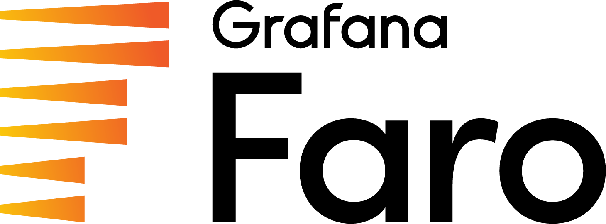

# Grafana Faro Web SDK

[![Build Status][faro-drone-status]][faro-drone]

The Grafana Faro Web SDK can instrument frontend JavaScript applications to collect telemetry and forward it to the
[Grafana Alloy][grafana-alloy-docs] (with faro receiver integration enabled), to a Grafana Cloud instance or to a
custom receiver. Grafana Alloy can then send this data to [Loki][grafana-logs] or [Tempo][grafana-traces].

The repository consists of multiple packages that can be combined depending on your requirements, as well as a
[demo][faro-demo], which can be run by following the [README.md file][faro-demo-readme].

## Get started

> [!NOTE]
> For more information, you can find the Faro documentation in the [Grafana Cloud docs for Faro](https://grafana.com/docs/grafana-cloud/monitor-applications/frontend-observability/instrument/).

See [quick start for web applications][faro-quick-start].

## Packages

### Core

[@grafana/faro-core][faro-core] is the main package that provides the core functionality of the SDK. The
[README.md][faro-core-readme] file provides an overview of the architecture and the API of library.

### Web SDK

[@grafana/faro-web-sdk][faro-web-sdk] provides instrumentations, metas and transports for use in web applications. See
the [README.md][faro-web-sdk-readme] for more information.

### Web Tracing

[@grafana/faro-web-tracing][faro-web-tracing] provides implementation for tracing web applications. See the
[README.md][faro-web-tracing-readme] for more information.

### React Support

[@grafana/faro-react][faro-react] is a package that enables easier integration in projects built with React. See the
[README.md][faro-react-readme] for more information.

[faro-drone]: https://drone.grafana.net/grafana/faro-web-sdk
[faro-drone-status]: https://drone.grafana.net/api/badges/grafana/faro-web-sdk/status.svg
[grafana-alloy-docs]: https://grafana.com/docs/alloy/latest/
[grafana-logs]: https://grafana.com/logs/
[grafana-traces]: https://grafana.com/traces/
[faro-core]: ./packages/core
[faro-core-readme]: ./packages/core/README.md
[faro-demo]: ./demo
[faro-demo-readme]: ./demo/README.md
[faro-quick-start]: ./docs/sources/tutorials/quick-start-browser.md
[faro-react]: ./packages/react
[faro-react-readme]: ./packages/react/README.md
[faro-web-sdk]: ./packages/web-sdk
[faro-web-sdk-readme]: ./packages/web-sdk/README.md
[faro-web-tracing]: ./packages/web-tracing
[faro-web-tracing-readme]: ./packages/web-tracing/README.md

## Releases

Faro releases follow the [Semantic Versioning](https://semver.org/) naming scheme: `MAJOR.MINOR.PATCH`.

- `MAJOR`: Major releases include large new features which will significantly change how Faro operates
  and possible backwards-compatibility breaking changes.
- `MINOR`: these releases include _new features which generally do not break_ backwards-compatibility.
- `PATCH`: patch releases include _bug and security fixes_ which do not break backwards-compatibility.

  > NOTE: Our goal is to provide regular releases that are as stable as possible,
  > and we take backwards-compatibility seriously. As with any software, always read the release notes
  > and the upgrade guide whenever choosing a new version of Faro to install.

## Supported Node versions

Faro supports all active LTS (Long Term Support) and current Node versions. When Node.js versions
reach end-of-life, we remove them from our test matrix and add new versions as they are released.
You can find a [release schedule on nodejs.org](https://nodejs.org/en/about/previous-releases#looking-for-the-latest-release-of-a-version-branch)

---

### 📢 Faro v2 Pre-release is Live! 🎉

We’re excited to announce that Faro v2 is now available in pre-release.
This version modernizes Faro, simplifies setup, and removes legacy code, to give users a cleaner and better performing experience.

#### ✨ What’s New

- Web Vitals v5 – Upgraded to v5 of Web Vitals library to remove FID metric and for improved performance.

- Cleaner Tracing APIs – Removed redundant/deprecated attributes.

- Simplified Setup – Simplified the console instrumentation configuration.

- Leaner Core – Deprecated packages and legacy internals were removed for improved stability.

#### ⚠️ Pre-release Note

- Please install using this version range **@^2.0.0-beta**
- 👉 **@latest** will continue to point to **v1.19.0** until v2 reaches GA.

##### Follow the upgrade guides for more information

[Upgrading Guide](https://grafana.com/docs/grafana-cloud/monitor-applications/frontend-observability/instrument/upgrading/upgrade-guide/)
[v2 Upgrade Guide](https://grafana.com/docs/grafana-cloud/monitor-applications/frontend-observability/instrument/upgrading/upgrade-v2/)

#### 🚀 Get Involved

- Contribute on [GitHub](https://github.com/grafana/faro-web-sdk)
- Share feedback: Grafana's Community Slack - [#faro](https://grafana.slack.com/archives/C048UH68BM5)

Thanks to all contributors and early adopters for helping us shape Faro v2! 💙
