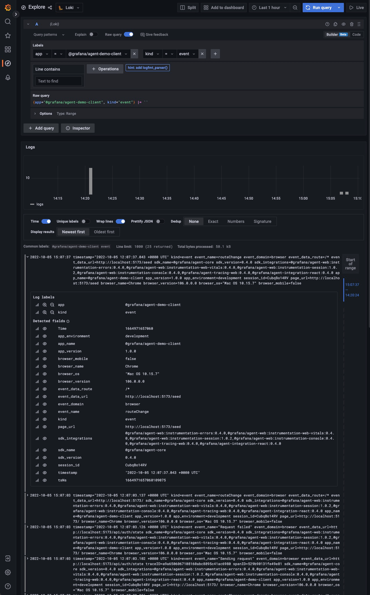
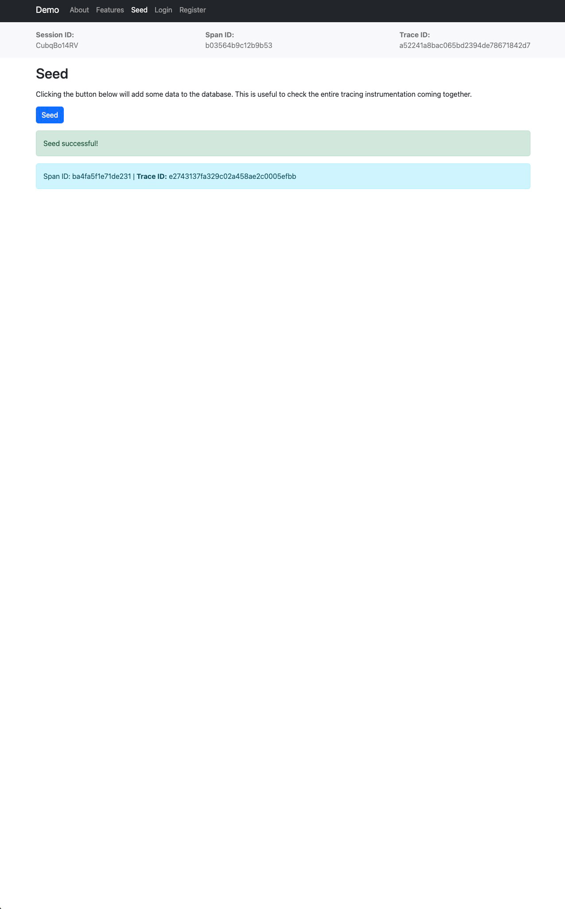
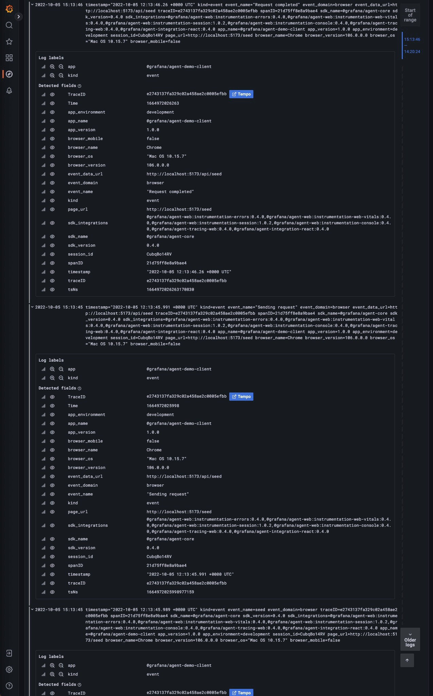
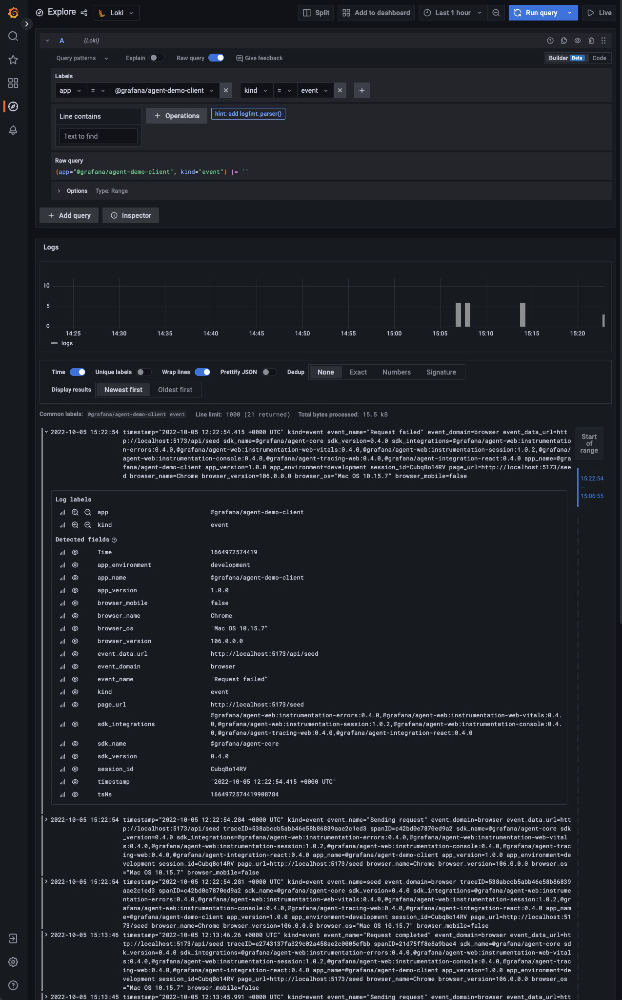

# Grafana JavaScript Agent Demo

This small project demonstrates how to use the Grafana JavaScript Agent and its packages.

The app is built using:

- Client
  - [React](https://reactjs.org/)
  - [React Router](https://reactrouter.com/en/main)
  - [Redux](https://redux.js.org/)
  - [Redux Toolkit](https://redux-toolkit.js.org/)
  - [Redux Toolkit Query](https://redux-toolkit.js.org/rtk-query/overview)
  - [Grafana JavaScript Agent](https://github.com/grafana/grafana-javascript-agent)
  - [Server-side rendering (SSR)](https://reactjs.org/docs/react-dom-server.html)
  - [React Bootstrap](https://react-bootstrap.github.io/)
  - [React Hook Form](https://react-hook-form.com/)
- Server
  - [Express](https://expressjs.com/)
  - [PostgreSQL](https://www.postgresql.org/)
  - [Sequelize](https://sequelize.org/)
  - [OpenTelemetry](https://opentelemetry.io/docs/instrumentation/js/)
    - Instrumentations:
      - [Express](https://www.npmjs.com/package/@opentelemetry/instrumentation-express)
      - [HTTP](https://www.npmjs.com/package/@opentelemetry/instrumentation-http)
      - [PostgreSQL](https://www.npmjs.com/package/@opentelemetry/instrumentation-pg)
      - [Winston](https://www.npmjs.com/package/@opentelemetry/instrumentation-winston)
  - [Winston](https://github.com/winstonjs/winston)
  - [prom-client](https://github.com/siimon/prom-client)
- Misc
  - [dotenv](https://github.com/motdotla/dotenv)
  - [Vite](https://vitejs.dev/)

Besides the app itself, the demo can also spawn the entire architecture for testing Grafana JavaScript Agent:

- [Grafana](https://grafana.com/oss/grafana/)
- [Loki](https://grafana.com/oss/loki/)
- [Tempo](https://grafana.com/oss/tempo/)
- [Cortex](https://cortexmetrics.io/)

## Installation

The demo can be run using containers. This is the easiest way to get started as it will spin up all the necessary
services. Moreover, the source code is mapped in the container so everytime a change occurs, there's no need to restart
the container(s).

The app will be available at [http://localhost:5173](http://localhost:5173) and Grafana will start at [http://localhost:3000/](http://localhost:3000/).

To start everything up, simply run:

```shell
docker-compose --profile demo up -d
```

This will automatically install dependencies, build the demo and start it in `development` mode.

## Instrumentation

There is various data that is captured in this app. Some data is caught automatically while other data is automatically
captured by the instrumentation provided by either Grafana JavaScript Agent and/or OpenTelemetry.

You can have a look over the following pages to understand what and how data is collected.

- [Errors](docs/features/errors.md)
- [Events](docs/features/events.md)
- [Logs](docs/features/logs.md)
- [Measurements](docs/features/measurements.md)
- [Metas](docs/features/metas.md)
- [Traces](docs/features/traces.md)

## User Journey

The next section will try to present the steps that a user usually does when navigating through a basic app and what
useful data is collected from those actions. In some cases the mechanism behind is also explained. To check how to
visualize the data, you can refer the one of the docs from the **Presentation** chapter.

All the actions will be performed assuming that the demo is freshly ran and the database is empty.

1. Navigate to the [Homepage](http://localhost:5173/)
   - Web Vitals are captured. They can be observed in the
     [Frontend dashboard in Grafana](http://localhost:3000/dashboards?query=Frontend)
   - Traces for the document load are created. They can be found in the
     [Explore page in Grafana](http://localhost:3000/explore) using the `Trace ID` property at the top of the page
   - An error is registered because the endpoint that returns the state of the user returns `401` status code
   - The `Session ID` at the top can be used to filter out the data collected during the current user journey
   - [](docs/assets/userJourney/homepage.png)
     [](docs/assets/userJourney/homepageTraces.png)
     [](docs/assets/userJourney/homepageWebVitals.png)
1. Navigate to the [Seed page](http://localhost:5173/seed)
   - `routeChange` event is registered with the new URL and the React route associated to that specific URL
   - [](docs/assets/userJourney/seed.png)
     [](docs/assets/userJourney/seedEvents.png)
1. Click on the `Seed` button to add some default data in the database
   - The following events are registered:
     - `seed`
     - `Sending Request` - created with every fetch request
     - `Request Completed` - created with every successful fetch request
   - The following spans are created:
     - The button click
     - A manual span which is associated with the `seed` event
     - The HTTP request to the API
     - The database calls
   - The `Trace ID` that appears under the button can be used to see the traces mentioned above
   - [](docs/assets/userJourney/seedSuccess.png)
     [](docs/assets/userJourney/seedSuccessEvents.png)<!-- markdownlint-disable-line MD013 -->
     [](docs/assets/userJourney/seedSuccessTraces.png)<!-- markdownlint-disable-line MD013 -->
1. Click on the `Seed` button again to generate an error:
   - The following events are registered:
     - `seed`
     - `Sending Request` - created with every fetch request
     - `Request Failed` - created with every failed fetch request
   - The traces are different from the step above because the DB threw an exception
   - The `Trace ID` that appears under the button can be used to see the traces mentioned above
   - [](docs/assets/userJourney/seedError.png)
     [](docs/assets/userJourney/seedErrorEvents.png)
     [](docs/assets/userJourney/seedErrorTraces.png)
1. Navigate to the [Register page](http://localhost:5173/auth/register)
   - `routeChange` event is registered with the new URL and the React route associated to that specific URL
1. Enter `john.doe@grafana.com` as email and the fill in the rest of the fields then click on the `Register` button
   - The following events are registered:
     - `registerAttempt`
     - `registerFailed`
   - Traces are collected as well
   - [](docs/assets/userJourney/registerError.png)
     [](docs/assets/userJourney/registerErrorEvents.png)
     [](docs/assets/userJourney/registerErrorTraces.png)
1. Navigate to the [Login page](http://localhost:5173/auth/login)
   - `routeChange` event is registered with the new URL and the React route associated to that specific URL
1. Login with the following credentials: `john.doe@grafana.com` as email and `test` as password
   - `routeChange` event is registered with the new URL and the React route associated to that specific URL
   - The following events are registered:
     - `loginAttempt`
     - `loginSuccess` - The `registerAttempt` -> `registerFailed` -> `loginAttempt` -> `loginSuccess` sequence allows us
       to understand that a user tried to create an account, already having one
   - Traces are collected as well
   - All the data captured from this point until logout will be associated with the `John Doe` user. Associating the
     `John Doe` user and `session ID` will allow us to see what actions the user performed prior logging in.
1. Click on the `First Article`
   - `routeChange` event is registered with the new URL and the React route associated to that specific URL
     - what's different from the other `routeChange` events is that the route for this event is not identical to the URL
       but what React received as an input (`/articles/view/:id`)
1. Input some text in the `Add Comment` section and click `Create Comment`
   - The following events are registered:
     - `createArticleCommentAttempt`
     - `createArticleCommentSuccessfully`
1. Click on the `Logout` button in the header
