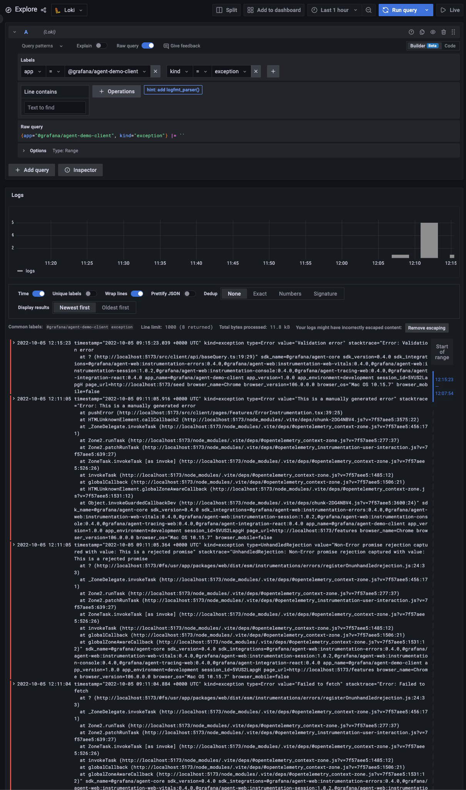
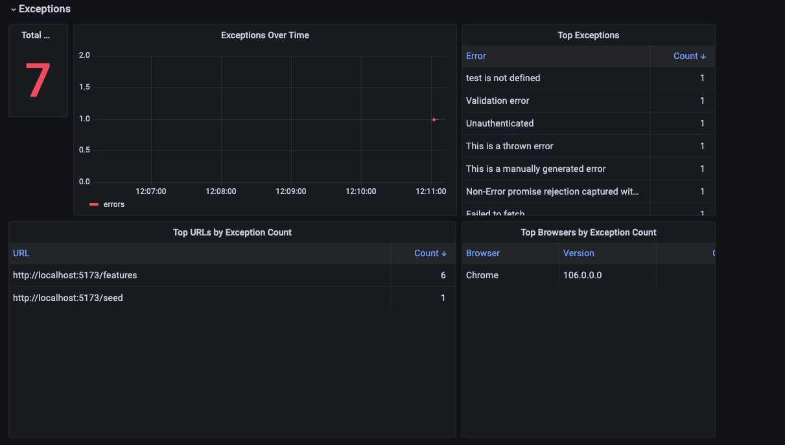

# Errors and Exceptions

All apps will eventually throw an error that will be treated by developers or exceptions when something unforeseen
happens.

## Description

### Client

In the case of errors (i.e. HTTP calls that return `4xx` or `5xx` status codes), we wrap the call in a `try/catch` block
for `async/await` operations or using `then` and `catch` for promises and use the `pushError` API provided by Grafana
JavaScript Agent to report them.

Exceptions are reported automatically as Grafana JavaScript Agent offers a way to automatically capture exceptions.

**The captured errors are stored in Loki.**

### API

The errors and exceptions that are captured server side are reported manually by writing them to a file which is then
read by the [Grafana Agent](https://github.com/grafana/agent).

**The captured errors are stored in Loki.**

**Given the way how the API reports the errors, they can't be filtered by `kind=exception` since they will appear as
logs.**

## Testing Scenario

- Manually instrumented requests returning an error
  - Navigate to the [Seed page](http://localhost:5173/seed)
  - Try to run the seed process at least twice (it won't work second or third time)
- Manually trigger an error or exception
  - Navigate to the [Features page](http://localhost:5173/features)
  - Click the buttons from the `Error Instrumentation` category
- Capturing a React error
  - Navigate to the [Features page](http://localhost:5173/features)
  - Click the `Increment` button from the `Error Boundary` category 3 times

## Visualizing the Data

- **Explore page**
  - Navigate to the [Explore page in Grafana](http://localhost:3000/explore)
  - Select the `Loki` datasource
  - To properly view the stacktrace, click on `Escape newlines` in Grafana, above the logs
- **Dashboard**
  - Navigate to the [Frontend dashboard in Grafana](http://localhost:3000/dashboards?query=Frontend)
  - Check the `Exceptions` category

## Screenshots

