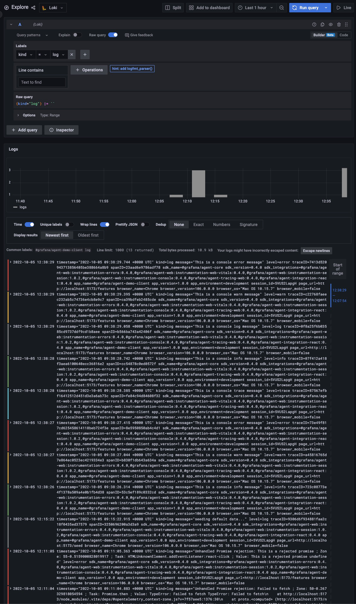

# Logs

Sometimes logs are important to debug an error that appeared in your app.

## Description

### Client

Out of the box, Grafana JavaScript Agent captures all logs levels, except for `debug`, `trace` and `log` since they are
too verbose.

But sometimes you may need to manually submit a log without it appearing in the browser console. For this, Grafana
JavaScript Agent provides an API called `pushLog` which can be used.

**The captured errors are stored in Loki.**

### API

The logs that are captured server side are reported manually by writing them to a file which is then read by the
[Grafana Agent](https://github.com/grafana/agent).

**Captured logs are stored in Loki.**

## Testing Scenario

- Navigate to the [Features page](http://localhost:5173/features)
- Click the buttons from the `Console Instrumentation` category
- There are two modes available:
  - `Console mode` - enabled by default - when this mode is activated, clicking the buttons will print the messages to
    the browser console and the Grafana JavaScript Agent Console Instrumentation picks it automatically from there.
  - `API mode` - enabled by clicking on the toggle - when this mode is activated, clicking the buttons will call the Grafana JavaScript
    Agent API and sends the log directly to the collector.

## Visualizing the Data

- Navigate to the [Explore page in Grafana](http://localhost:3000/explore)
- Select the `Loki` datasource
- To properly view the stacktrace, click on `Escape newlines` in Grafana, above the logs

## Screenshots

