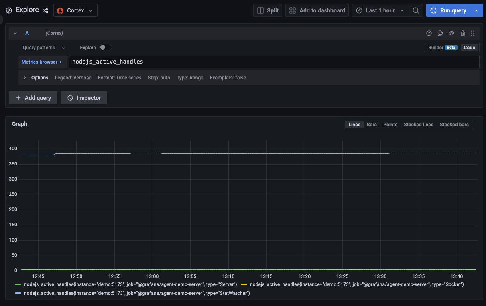

# Measurements

Measurements (aka metrics) are indicators for tracking performance or other numeric values.

## Description

### Client

[Web Vitals](https://web.dev/vitals/) are the only measurements captured automatically by Grafana JavaScript Agent.

Besides the automatically captured measurements, Grafana JavaScript Agent API also provides a `pushMeasurement` method
that can be used to track measurements.

**Captured frontend measurements are stored in Loki instead of Prometheus to avoid cardinality issues.**

### API

On the server side, [prom-client](https://github.com/siimon/prom-client) is used to automatically capture default
measurements, which are exposed publicly on the [Metrics page](http://localhost:5173/metrics).
[Grafana Agent](https://github.com/grafana/agent) scrapes and records metrics at a specified time interval.

**Given that we use [prom-client]https://github.com/siimon/prom-client) for pushing server-side metrics, they are stored
in Prometheus rather than Loki.**

## Testing Scenario

- **Web Vitals**
  - Navigate to the [Frontend dashboard in Grafana](http://localhost:3000/dashboards?query=Frontend)
  - Look at the metrics at the top
  - Refresh the app a couple of times
  - Navigate back to the dashboard and check the differences
- **Manually tracked measurement**
  - Navigate to the [Features page](http://localhost:5173/features)
  - Click on the `Send Custom Metric` button

## Visualizing the Data

- **Web Vitals**
  - Navigate to the [Frontend dashboard in Grafana](http://localhost:3000/dashboards?query=Frontend)
  - Check the `Exceptions` category
- **Manually tracked measurements**
  - Navigate to the [Explore page in Grafana](http://localhost:3000/explore)
  - **Client**
    - Select the `Loki` datasource
    - Select `kind=measurement` in the filters
  - **API**
    - Select the `Cortex` datasource
    - Run any PromQL query (i.e. `nodejs_active_handles`)

## Screenshots

