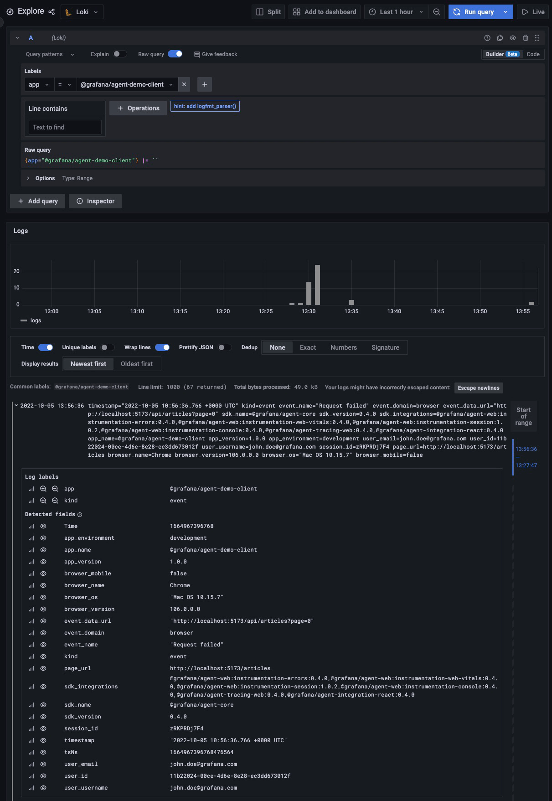

# Metas

Metas can be seen as labels. They are additional data that accompany the errors, events etc. in order to filter them
better.

## Description

### Client

Grafana JavaScript Agent requires `app` meta as the only mandatory meta when initializing the library. Besides `app`,
it automatically creates a `session` meta which can also be set manually in some cases (i.e. sharing the same session
with the API, storing the session ID etc.).

Another meta which is set dynamically is the `user` meta. This contains one or more of the following: user name, user
email and/or user ID.

The session and user metas can be used to look for all the data captured from a specific session or user and both can
be combined to track the activity of a user prior to logging in.

### API

Metas in the API are similar to the ones provided by Grafana JavaScript Agent but they are required by OpenTelemetry.

## Testing Scenario

- Navigate to the [Homepage](http://localhost:5173/)
- Get the session ID from the top of the page
- Navigate to the [Features Page](http://localhost:5173/features)
- Click on the `Start new session` button from the `Events` category
- Perform other operations in the app
- Observe and get the new session ID

## Visualizing the Data

- Navigate to the [Explore page in Grafana](http://localhost:3000/explore)
- Select the `Cortex` or `Loki` as a datasource
- Input the session IDs copied previously into the label filters or line filters

## Screenshots

