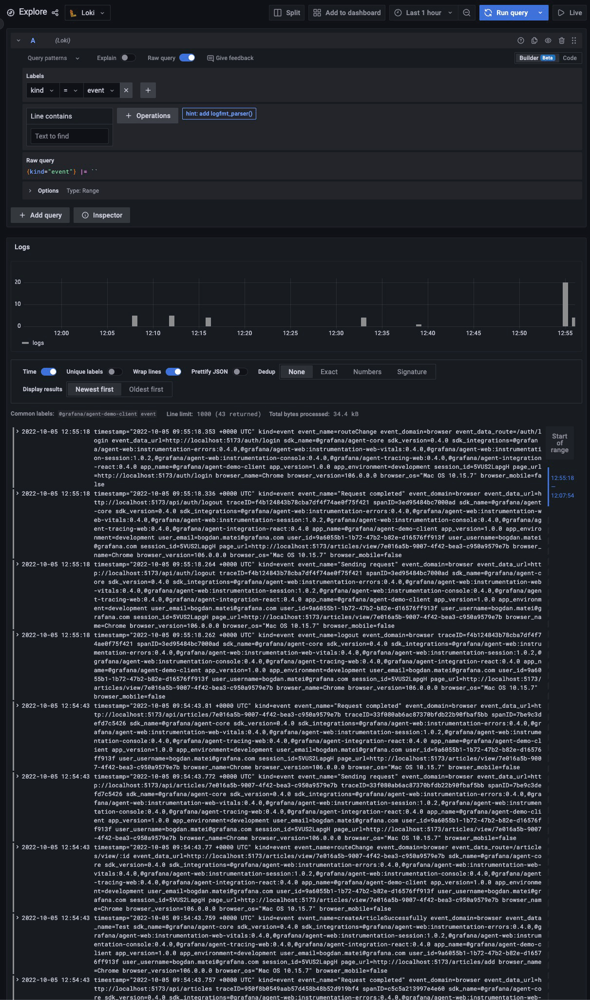
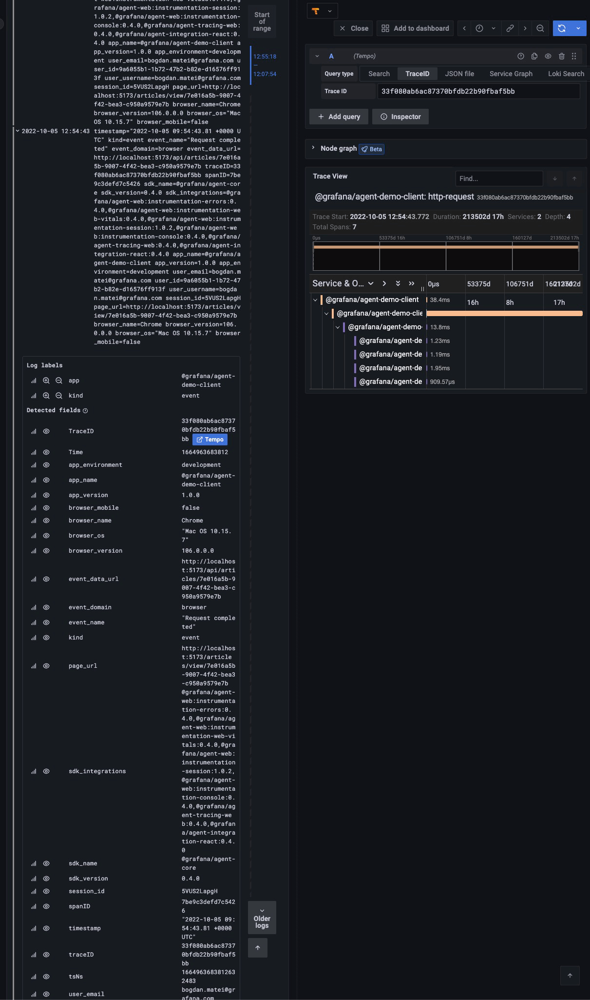

# Events

Events are actions performed by the user while using your application and/or specific events that happened and have
a clear business meaning (i.e. the user arrived on the page with a specific query parameter). Events differ from logs
in that they have pre-determined structure and attributes.

## Description

### Client

The app contains a lot of automatically captured events (i.e. page navigations captured by the React Instrumentation
provided by the Grafana JavaScript Agent) but also manually created events (i.e. creating an article, adding a comment,
logging in and logging out etc.).

**Captured errors are stored in Loki.**

### API

For the time being the API does not provide any events.

## Testing Scenario

- Navigate to the [Homepage](http://localhost:5173/)
- Go to the [Seed page](http://localhost:5173/seed)
- Click the `Seed` button (it doesn't matter if it throws an error or not)
- Go to the [Register page](http://localhost:5173/auth/register)
- Complete the registration process
- Go to the [Add article page](http://localhost:5173/articles/add)
- Add an article
- Leave a comment on the article you just created
- Click `Logout` on the menu bar

## Visualizing the Data

- Navigate to the [Explore page in Grafana](http://localhost:3000/explore)
- Select the `Loki` datasource
- Select `kind=event` in the filters
- Some events (i.e. `Request Completed`) are tied to a span or a series of spans. Expanding such an event allows you to
  access the corresponding spans by clicking the `Tempo` button.

## Screenshots

<!-- markdownlint-disable-line MD013 -->
