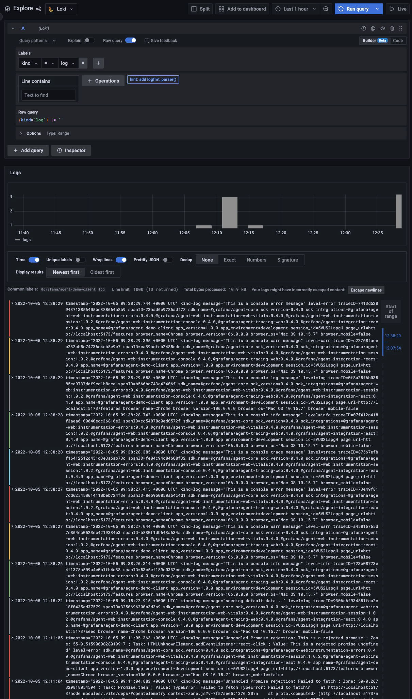

# Logs

Logs can provide context and detail into what is going on in your application and be critical to troubleshooting errors.

## Description

### Client

Out of the box, Faro captures all logs provided by invoking `console.info()`, `console.error()` and `console.warn()`.

But sometimes you may need to manually submit a log without it appearing in the browser console. For this, the Faro API
provides an API called `pushLog` which can be used.

**Captured logs are stored in Loki.**

### API

The logs that are captured server side are reported manually by writing them to a file which is then read by the
[Grafana Agent][grafana-agent].

**Captured logs are stored in Loki.**

## Testing Scenario

- Navigate to the [Features page][demo-features-page]
- Click the buttons from the `Console Instrumentation` category
- There are two modes available:
  - `Console mode` - enabled by default - when this mode is activated, clicking the buttons will print the messages to
    the browser console and the Faro Console Instrumentation picks it automatically from there.
  - `API mode` - enabled by clicking on the toggle - when this mode is activated, clicking the buttons will call the
    Faro API and sends the log directly to the collector.

## Visualizing the Data

- Navigate to the [Explore page in Grafana][demo-grafana-explore]
- Select the `Loki` datasource
- To properly view the stacktrace, click on `Escape newlines` in Grafana, above the logs

## Screenshots

[][assets-logs-view-explore]

[demo-features-page]: http://localhost:5173/features
[demo-grafana-explore]: http://localhost:3000/explore
[grafana-agent]: https://github.com/grafana/agent
[assets-logs-view-explore]: ../assets/instrumentations/logsViewExplore.png
