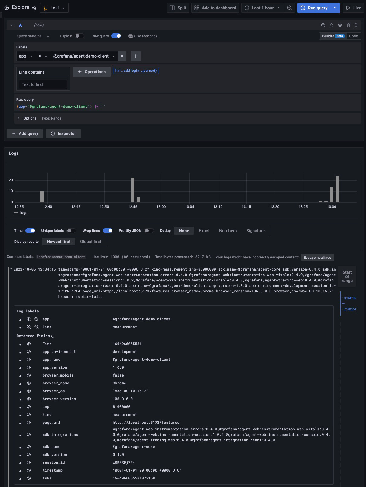
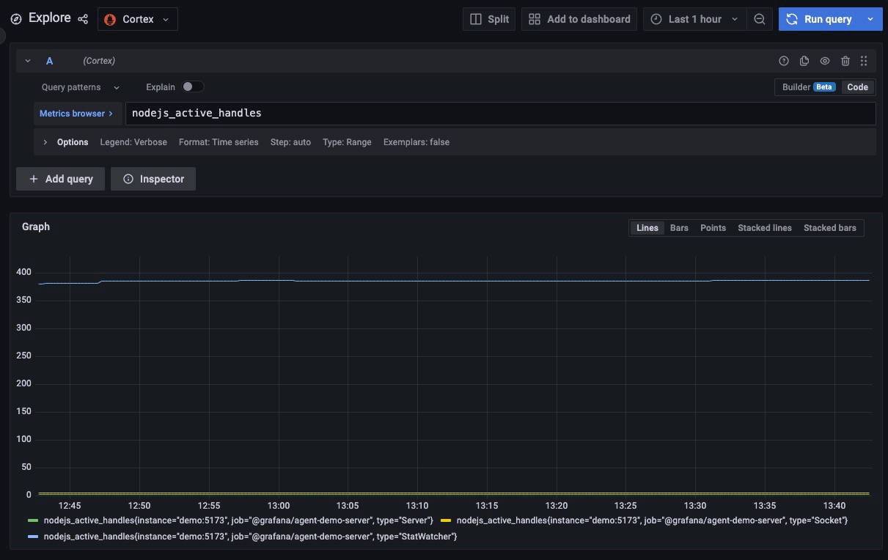
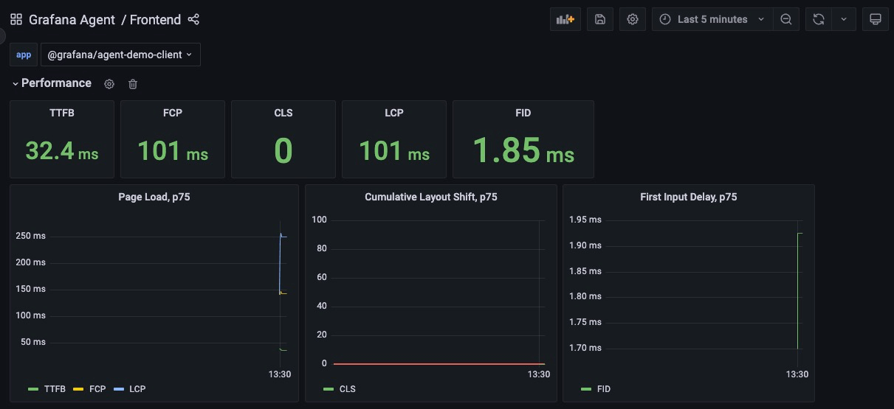

# Measurements

Measurements (aka metrics) are indicators for tracking performance or other numeric values.

## Description

### Client

[Web Vitals][web-vitals] are the only measurements captured automatically by Faro.

Besides the automatically captured measurements, Faro API also provides a `pushMeasurement` method that can be used to
track measurements.

**Captured frontend measurements are stored in Loki instead of Prometheus to avoid cardinality issues.**

### API

On the server side, [prom-client][prom-client] is used to automatically capture default measurements, which are exposed
publicly on the [Metrics page][demo-metrics-page]. [Grafana Agent][grafana-agent] scrapes and records metrics at a
specified time interval.

**Given that we use [prom-client][prom-client] for pushing server-side metrics, they are stored in Prometheus rather
than Loki.**

## Testing Scenario

- **Web Vitals**
  - Navigate to the [Frontend dashboard in Grafana][demo-grafana-frontend-dashboard]
  - Look at the metrics at the top
  - Refresh the app a couple of times
  - Navigate back to the dashboard and check the differences
- **Manually tracked measurement**
  - Navigate to the [Features page][demo-features-page]
  - Click on the `Send Custom Metric` button

## Visualizing the Data

- **Web Vitals**
  - Navigate to the [Frontend dashboard in Grafana][demo-grafana-frontend-dashboard]
  - Check the `Exceptions` category
- **Manually tracked measurements**
  - Navigate to the [Explore page in Grafana][demo-grafana-explore]
  - **Client**
    - Select the `Loki` datasource
    - Select `kind=measurement` in the filters
  - **API**
    - Select the `Cortex` datasource
    - Run any PromQL query (i.e. `nodejs_active_handles`)

## Screenshots

[][assets-measurements-view-explore-loki]<!-- markdownlint-disable-line MD013 -->
[][assets-measurements-view-explore-cortex]<!-- markdownlint-disable-line MD013 -->
[][assets-measurements-view-dashboard]<!-- markdownlint-disable-line MD013 -->

[demo-features-page]: http://localhost:5173/features
[demo-grafana-explore]: http://localhost:3000/explore
[demo-grafana-frontend-dashboard]: http://localhost:3000/dashboards?query=Frontend
[demo-metrics-page]: http://localhost:5173/metrics
[grafana-agent]: https://github.com/grafana/agent
[prom-client]: https://github.com/siimon/prom-client
[web-vitals]: https://web.dev/vitals/
[assets-measurements-view-dashboard]: ../assets/instrumentations/measurementsViewDashboard.png
[assets-measurements-view-explore-cortex]: ../assets/instrumentations/measurementsViewExploreCortex.png
[assets-measurements-view-explore-loki]: ../assets/instrumentations/measurementsViewExploreLoki.png
