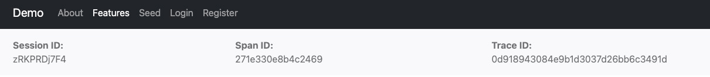
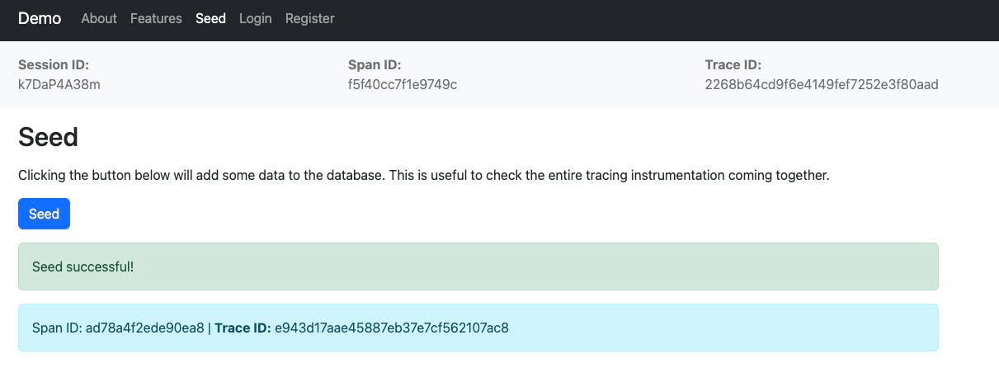
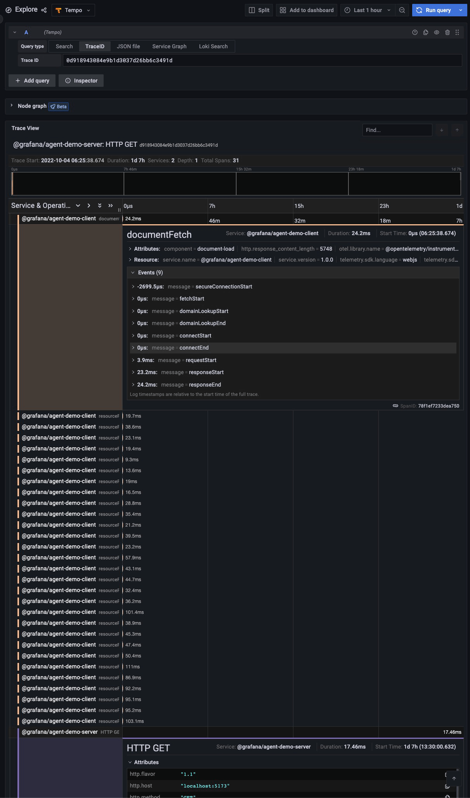
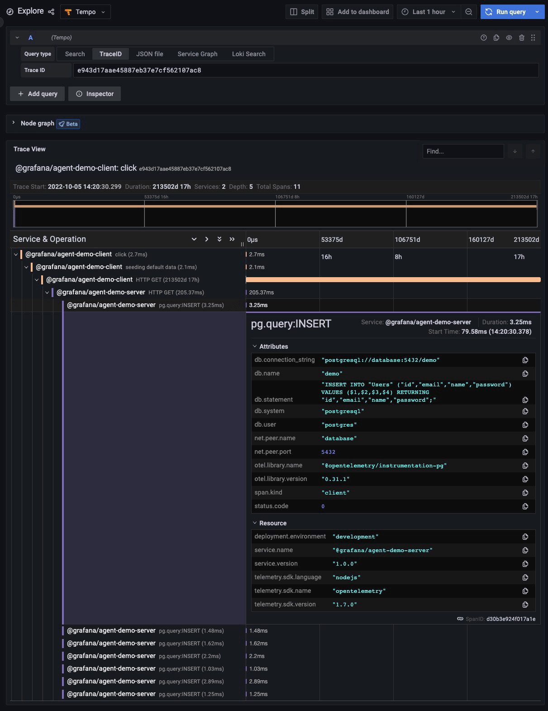

# Traces

Traces are sets of data linked between them that describe the timeline and events of a specific action (i.e. what
happens in the API when a request is received from the client).

## Description

### Client

Faro provides auto-instrumentation for traces. This contains: resources loaded when the page loads, fetch requests and
user interactions (clicks etc.).

When executing fetch requests, an additional `traceparent` header is added to the request. This header is then read by
OpenTelemetry in the API to associate and server side actions with the spans captured on the client.

Besides auto-instrumentation, Faro also provides an API called `pushTraces` to manually report a span etc.

**The captured traces are stored in Tempo.**

### API

At the API level, OpenTelemetry is used to create traces for internal and external services. A couple of the
instrumented services are: the app server, the logger, the database etc.

When initial document is loaded, OpenTelemetry instrumentation creates a series of spans for the server-side events
(i.e. database calls). The primary span ID and the trace ID are sent back to the client via the `traceparent` meta. The
Tracing Instrumentation provided by Faro automatically reads the `traceparent` meta and uses it when instrumenting the
resource loading for the document.

**The captured traces are stored in Tempo.**

## Testing Scenario

- Traces captured during initial page load
  - Navigate to the [Homepage][demo-homepage]
  - Grab the trace ID from the top of the page
- Integration between manual and auto instrumented events
  - Navigate to the [Seed page][demo-seed-page]
  - Click the Seed button
  - Note the trace ID that appears below the button

## Visualizing the Data

- Navigate to the [Explore page in Grafana][demo-grafana-explore]
- Select `Tempo` datasource
- Input the copied trace ID in the `Trace ID` field

## Screenshots

[][assets-traces-view-app-doc-load]
[][assets-traces-view-app-seed]
[][assets-traces-view-explore-doc-load]
[][assets-traces-view-explore-seed]

[demo-grafana-explore]: http://localhost:3000/explore
[demo-homepage]: http://localhost:5173/
[demo-seed-page]: http://localhost:5173/seed
[assets-traces-view-app-doc-load]: ../assets/instrumentations/tracesViewAppDocumentLoad.png
[assets-traces-view-app-seed]: ../assets/instrumentations/tracesViewAppSeed.png
[assets-traces-view-explore-doc-load]: ../assets/instrumentations/tracesViewExploreDocumentLoad.png
[assets-traces-view-explore-seed]: ../assets/instrumentations/tracesViewExploreSeed.png
