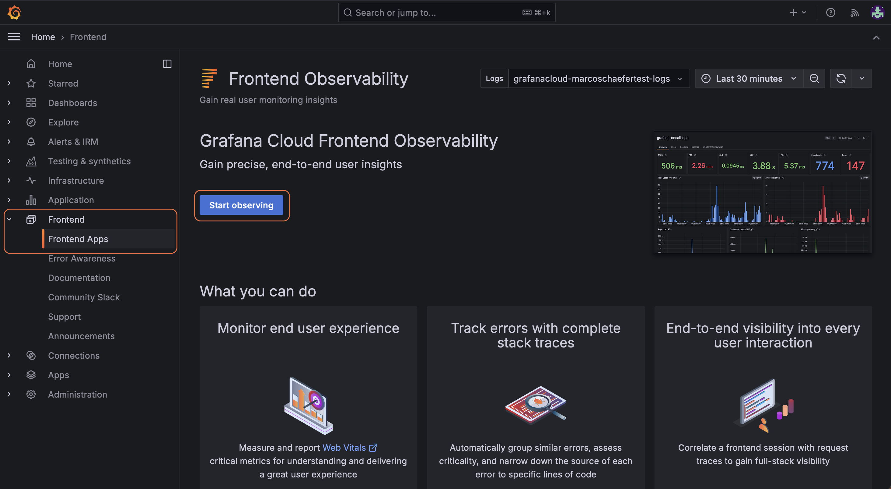
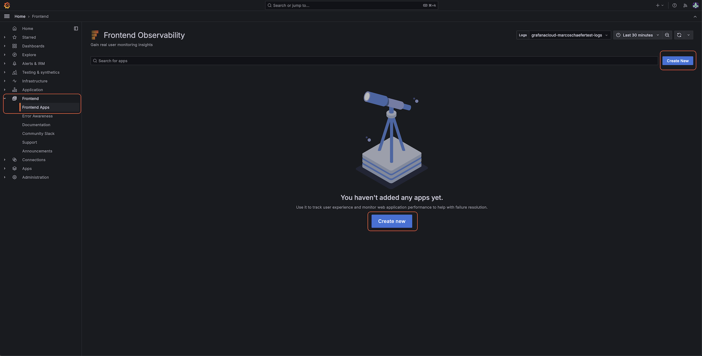
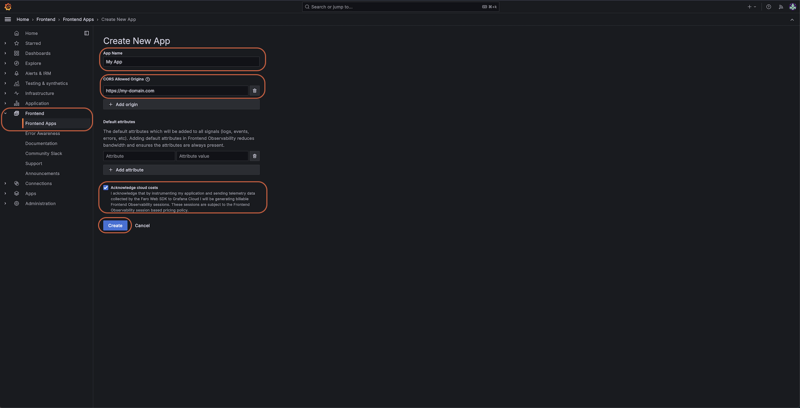
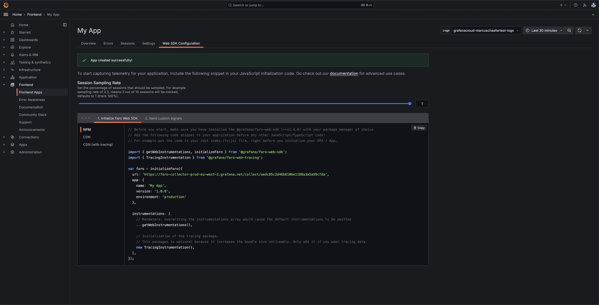

// Note: the cloud setup part will be deleted from this readme because it's cloud specific. It'll be only available in the cloud docs

# Frontend Observability quickstart

Follow these steps to get started quickly with Grafana Frontend Observability:

1. Create an application in Frontend Observability
2. Instrument your web application with Faro an connect it to Frontend Observability
3. Observe the state of your web in Frontend Observability in Frontend Observability

This guide shows how to instrument a web application and connect to Grafana Cloud Frontend Observability.

## Create an application in Frontend Observability

To observe Real User Monitoring (RUM) data in Grafana Cloud Frontend Observability an app needs to
created in the Frontend Observability plugin.

1. Sign in to your Grafana Cloud account or register a free Grafana Cloud account otherwise.
2. Locate and expand the `Frontend` section in the side menu and select `Frontend Apps`.

- If it is the first time you visit `Frontend Apps` a landing page appears. Just press the `Start observing`
  button which will bring you to the empty frontend apps overview page.
  

- Otherwise you are directly routed to the frontend apps overview page.
  

3. Create an app, which acts as a container to visualize the RUM data of your web application

   3.1 Press `Create new` on the app overview page, which opens the app configuration form.

   3.2 Configure the application:

   - Give your app a meaningful name
   - Add the domain of your web-application
   - Read and acknowledge the note about costs
   - Press the `Create` button

     

4. After the has been created you are routed to the `Web SDK Configuration` page.

   - It contains a snippet to be integrated in your web-application
   - The snippet is pre-configured according to the configuration from app configuration form
     config.
   - All data sources are auto configured for you
   - The snippet also contains the URL to the Faro Cloud Collector

     

5. Copy the snippet into the `<head />` of your document and Faro is auto instrumenting your web-application

6. Open your Frontend Observability application to observe the RUM data from you web-application

// ===========

# Set up the Faro React distribution of the Faro Web SDK

The Faro Web-SDK is a highly configurable open source real user monitoring (RUM) library built on OpenTelemetry and integrating seamlessly with Grafana Cloud and Grafana Frontend Observability.
Faro-React is a distribution of the Faro Web SDK for project using React, which offers easier integrations and the following features:

- **Support for React Router v6 or v4/v5.x**: send events for all route changes, including the data router API
- **Error boundary**: enhancements to stack traces and configuration options for `pushError` behavior
- **Component profiler**: to capture component renders, un/mounting time, and more
- **SSR support** server side rendering support for React

This document covers setting up Faro-React with React Router v6 with or without the data router API, and v4/v5.x.

## React router with data router

The data router API is only available in React Router from v6.x.

If you use React Router v4/v5x, or want to use React Router v6 without the data router API refer to the [React router without data router](#react-router-without-data-router) section of the documentation.

To upgrade your project to React Router v6 and the data router API, refer to the [Upgrade to a data router](#upgrade-to-a-data-router) section of the documentation.

Follow these steps to set up Faro-React and React Router v6 with the data router API:

1. Install Faro-React package
2. Import and initialize Faro
3. Instrument the data router

## Install Faro

First add Faro-React to your project. Install the Faro-React package by running the following command for NPM:

```sh
# install globally
npm i @grafana/faro-react
```

Or the following command Yarn:

```sh
yarn add @grafana/faro-react
```

## Import and initialize Faro

The Faro-React package offers all the functionality and behavior from the Faro Web-SDK package plus
additional React specific functionality like router instrumentation, a custom ErrorBoundary, and more.

The following code sample shows you how to import Faro-React and the minimum setup needed to get
insights into the health and performance of your application or website:

```ts
import { initializeFaro } from '@grafana/faro-react';

initializeFaro({
  // required: the URL of the Grafana collector
  url: 'my/collector/url',

  // required: the identification label of your application
  app: {
    name: 'my-react-app',
  },
});
```

After Faro-React is initialized it sets up several instrumentation and starts capturing data about your application's health and performance and exports them to a data collector.

Faro supports the Faro receiver data collector which is mandatory for Grafana Cloud. Faro receiver is automatically configured.

Open source users can use the Grafana Agent as their data collector, to learn more consult the [Faro receiver with Grafana Agent flow mode documentation](https://grafana.com/docs/agent/latest/flow/reference/components/faro.receiver/).

### Instrument the data router

Building on the minimum setup, this section shows you how to instrument the routes from a React data router (BrowserRouter, HashRouter, or MemoryRouter).

In the file you create your data router, often the `App.\*` file pass your data router to the Faro-React
function `withFaroRouterInstrumentation` to wrap all your routes with Faro instrumentation:

```ts
const reactBrowserRouter = createBrowserRouter([
  // your routes...
]);

const browserRouter = withFaroRouterInstrumentation(reactBrowserRouter);
```

// Conclusion:
// - This is all you need to setup instrumentation and automatically capture events
// - Next:
// - see documentation on capturing custom events
// - see error boundary, component profiler, SSR support

## Upgrade to a data router

This section describes how to upgrade the Faro React router instrumentation if you already have a React app instrumented which does not use data routers.

In the `ReactIntegration` call, change the `version` property from `ReactRouterVersion.[V4|V5|V6]` to `ReactRouterVersion.V6_data_router`.

If you use React Router v4 or v5 remove the `history` and `Route` dependencies and add the `matchRoutes` function exported by `react-router-dom`.

If you use React Router v6 remove the following dependencies from the dependencies `object`:

- `createRoutesFromChildren`
- `Routes`
- `useLocation`
- `useNavigationType`

The `ReactIntegration` call should look similar to:

```ts
import { matchRoutes } from 'react-router-dom';

import { getWebInstrumentations, initializeFaro, ReactIntegration, ReactRouterVersion } from '@grafana/faro-react';

initializeFaro({
  // ...

  instrumentations: [
    // Load the default Web instrumentations
    ...getWebInstrumentations(),

    new ReactIntegration({
      router: {
        version: ReactRouterVersion.V6_data_router,
        dependencies: {
          matchRoutes,
        },
      },
    }),
  ],
});
```

Next you need to remove the Faro route components `<FaroRoute/>` or `<FaroRoutes/>` and [instrument the data router](#instrument-the-data-router).

// new standalone tut

# React router without data router

// Sean: explanation of what this tutorial is doing

Learn how to set up Faro-React with React Router v4, v5 or v6 without Data routers.

## Install Faro

First add Faro-React to your project. Install the Faro-React package by running the following command for NPM:

```sh
# install globally
npm i @grafana/faro-react
```

Or the following command Yarn:

```sh
yarn add @grafana/faro-react
```

// todo: add complete sections like data router

## Import and initialize Faro

### Instrument router

First add a new `ReactIntegration` to the instrumentation list in the `initializeFaro()` function and
configure it by passing the dependencies needed to instrument the React Router you are using in your
app.

First tell Far React what version of the React Router you want to instrument via the `version` property.

```ts
 new ReactIntegration({
      router: {
        version: ReactRouterVersion.V6,
      },
    }),
```

Then import `createRoutesFromChildren`, `matchRoutes`, `Routes`, `useLocation`, `useNavigationType`
from `react-router-dom` and pass them to the dependencies object.

```ts
import { createRoutesFromChildren, matchRoutes, Routes, useLocation, useNavigationType } from 'react-router-dom';

new ReactIntegration({
  router: {
    version: ReactRouterVersion.V6,
    dependencies: {
      createRoutesFromChildren,
      matchRoutes,
      Routes,
      useLocation,
      useNavigationType,
    },
  },
  }),
```

The final result should look similar like this example.

```ts
import { createRoutesFromChildren, matchRoutes, Routes, useLocation, useNavigationType } from 'react-router-dom';

import { getWebInstrumentations, initializeFaro, ReactIntegration, ReactRouterVersion } from '@grafana/faro-react';
import { TracingInstrumentation } from '@grafana/faro-web-tracing';

initializeFaro({
  // Mandatory, the URL of the Grafana collector
  url: 'my/collector/url',

  // Mandatory, the identification label of your application
  app: {
    name: 'my-react-app',
  },

  // ...

  instrumentations: [
    // Load the default Web instrumentations
    ...getWebInstrumentations(),

    new ReactIntegration({
      router: {
        version: ReactRouterVersion.V6,
        dependencies: {
          createRoutesFromChildren,
          matchRoutes,
          Routes,
          useLocation,
          useNavigationType,
        },
      },
    }),
  ],
});
```

To apply the router instrumentation to React Router v6 routes, import the `<FaroRoutes/>` component and use
it instead of the original `<Routes />` component as defined by React Router v6 like in the example
below.

```tsx
import { FaroRoutes } from '@grafana/faro-react';

// during render
<FaroRoutes>
  <Route path="/" element={<Home />} />
  {/* ... */}
</FaroRoutes>;
```

To instrument React Router v4 or v5 use the following instructions.

First add a new `ReactIntegration` to the instrumentation list in the `initializeFaro()` function and
configure it by passing the dependencies needed to instrument the React Router you are using in your
app.

First tell Far React what version of the React Router you want to instrument via the `version` property
`ReactRouterVersion.V4` or `ReactRouterVersion.V5`.

```ts
 new ReactIntegration({
      router: {
        // If you use React Router v4
        version: ReactRouterVersion.V4,

        // or if you use React router v5
        version: ReactRouterVersion.V5
      },
    }),
```

Then import the `Route` component from `react-router-dom` and the `history` object you are using from
the `history` package and pass them to the dependencies object.

```ts
import { createBrowserHistory } from "history";
import { Route } from "react-router-dom";

const history = createBrowserHistory();

new ReactIntegration({
  router: {
    version: ReactRouterVersion.V5, // or ReactRouterVersion.V4,
    dependencies: {
      history,
      Route,
    },
  },
}),
```

The final result should look similar like this example.

```ts
import { createRoutesFromChildren, matchRoutes, Routes, useLocation, useNavigationType } from 'react-router-dom';

import { getWebInstrumentations, initializeFaro, ReactIntegration, ReactRouterVersion } from '@grafana/faro-react';
import { TracingInstrumentation } from '@grafana/faro-web-tracing';

initializeFaro({
  // Mandatory, the URL of the Grafana collector
  url: 'my/collector/url',

  // Mandatory, the identification label of your application
  app: {
    name: 'my-react-app',
  },

  // ...

  instrumentations: [
    // Load the default Web instrumentations
    ...getWebInstrumentations(),

    new ReactIntegration({
      router: {
        version: ReactRouterVersion.V5, // or ReactRouterVersion.V4,
        dependencies: {
          history, // the history object used by react-router
          Route, // Route component imported from react-router package
        },
      },
    }),
  ],
});
```

To apply the router instrumentation to React Router v4, v5 routes, import the `<FaroRoute />` component and use
this instead of the original `<Route />` component to define your routes like in the example
below.

```tsx
import { FaroRoute } from '@grafana/faro-react';

// during render
<Switch>
  <FaroRoute path="/">
    <Home />
  </FaroRoute>
  {/* ... */}
</Switch>;
```

## Error boundary

```tsx
import { FaroErrorBoundary } from '@grafana/faro-react';

// during render
<FaroErrorBoundary>
  <App />
</FaroErrorBoundary>;
```

or

```tsx
import { withErrorBoundary } from '@grafana/faro-react';

export default withErrorBoundary(App);
```

_pushErrorOptions prop_

```tsx

import { FaroErrorBoundary, PushErrorOptions } from '@grafana/faro-react';

const pushErrorOptions: PushErrorOptions = {
  type: "Custom Error Type"
  context: {
    foo: "bar",
    baz: "qux"
  },
  // ...
}
```

```html
<!-- during render -->
<FaroErrorBoundary pushErrorOptions="{pushErrorOptions}"> <App /> </FaroErrorBoundary>;
```

## Component profiler

Use the Faro Profiler to get insights into the rendering performance on a React component level.
To use the Faro profiler you need to install the Faro web-tracing package.

Note:
Using the profiler has an impact on performance.
We recommend to use it carefully and to not overutilize it by instrumenting many components.

Initialize Faro React

```ts
import { matchRoutes } from 'react-router-dom';

import { getWebInstrumentations, initializeFaro } from '@grafana/faro-react';
import { TracingInstrumentation } from '@grafana/faro-web-tracing';

initializeFaro({
  // Mandatory, the URL of the Grafana collector
  url: 'my/collector/url',

  // Mandatory, the identification label of your application
  app: {
    name: 'my-react-app',
  },

  instrumentations: [
    // Load the default Web instrumentations
    ...getWebInstrumentations(),

    // Tracing Instrumentation is needed if you want to use the React Profiler
    new TracingInstrumentation(),

    // ...
  ],
});
```

```tsx
import { withFaroProfiler } from '@grafana/faro-react';

export default withFaroProfiler(MyReactComponent);
```

## SSR support

When using SSR, Faro needs to initialized a bit differently for the server side.
Setup for the client side is as mentioned above.

_v6_

```tsx
import { FaroErrorBoundary, setReactRouterV6SSRDependencies } from '@grafana/faro-react';
setReactRouterV6SSRDependencies({ Routes });

export function renderToString(...) {
  return reactRenderToString(
    <FaroErrorBoundary>
      <StaticRouter location={...}>
        <App />
      </StaticRouter>
    </FaroErrorBoundary>
  ),
}
```

_v6 data router_
No special config needed.
Just wrap your data router with `withFaroRouterInstrumentation(dataRouter)` in your routes file.

_v5_

```tsx
import { FaroErrorBoundary, setReactRouterV4V5SSRDependencies } from '@grafana/faro-react';
setReactRouterV4V5SSRDependencies({ Route, history });

export function renderToString(...) {
  return reactRenderToString(
    <FaroErrorBoundary>
      <StaticRouter location={...}>
        <App />
      </StaticRouter>
    </FaroErrorBoundary>
  ),
}
```
