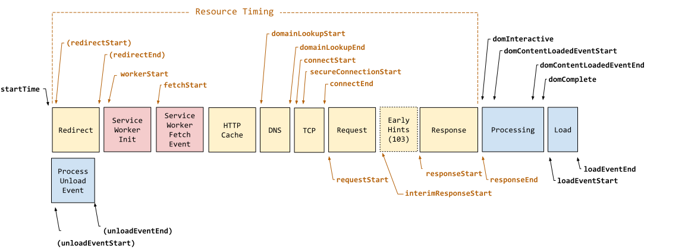

# Track Navigation and Resource performance.

> NOTE:
> This doc is WIP.
> Once finished,we move it into the Grafana cloud docs and delete it from this repo.

To enable measuring of different performance characteristics of a web-application, browser provide an
API to receive detailed performance metrics across the lifetime of a web-application.

Among different performance metrics a browser provides information related to the navigation ([PerformanceNavigationTiming](https://developer.mozilla.org/en-US/docs/Web/API/PerformanceNavigationTiming))
of a document and resources loaded by a page ([PerformanceResourceTiming](https://developer.mozilla.org/en-US/docs/Web/API/PerformanceResourceTiming)).

It is important to be able to get insights into navigation and resource performance of a web-application.
For example to find out where time is spent for a slow navigation or to get insights into what resources
are loaded by a page, the loading performance of those resources and much more.

The `PerformanceNavigationTiming` and `PerformanceResourceTiming` entries as emitted by the browser
contain a lot of very technical information.

To make it easier to use and interpret those metrics, Faro uses above items and calculates custom
metrics from them which it sends as events of type `faro.performance.navigation` and `faro.performance.resource`.
Additionally it enriches these events with extra information which makes it possible to directly find out
what resources belong to a specific navigation, mapping to the previous navigation and if a navigation
was loaded in foreground or background.

## Metrics

Faro calculates the following metrics from the `PerformanceNavigationTiming` and `PerformanceResourceTiming`
emitted by the browser.

todo: draw image

## How to use

## Where to find (fe-o11y)
