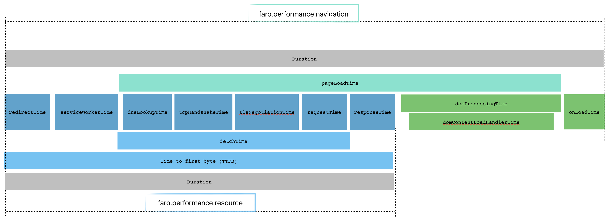

# Track Navigation and Resource performance.

> NOTE:
> This doc is WIP.
> Once finished,we delete the README file and add teh documentation to the Grafana cloud docs.

To enable measuring of different performance characteristics of a web-application, browser provide an
API to receive detailed performance metrics across the lifetime of a web-application.

Among different performance metrics a browser provides information related to the navigation ([PerformanceNavigationTiming](https://developer.mozilla.org/en-US/docs/Web/API/PerformanceNavigationTiming))
of a document and resources loaded by a page ([PerformanceResourceTiming](https://developer.mozilla.org/en-US/docs/Web/API/PerformanceResourceTiming)).

> Think of a navigation as single full page load, like a user opens the page, reloads a page or follows a link like a menu item which loads a new page

> A resource is data loaded while navigating the page, such JavaScript or CSS files, images or fonts.

It is important to be able to get insights into navigation and resource performance of a web-application.
For example to find out where time is spent for a slow navigation or to get insights into what resources
are loaded by a page, the loading performance of those resources and much more.

The `PerformanceNavigationTiming` and `PerformanceResourceTiming` entries as emitted by the browser
contain a lot of very technical information.

To make it easier to use and interpret those metrics, Faro captures above entries and calculates custom
metrics from them which it sends as events of type `faro.performance.navigation` and `faro.performance.resource`.
Additionally it enriches these events with extra information which makes it possible to directly find out
what resources belong to a specific navigation, mapping to the previous navigation and if a navigation
was loaded in foreground or background.

Additionally Faro create a unique ID per event. Among other advantages, this enables to easily map
resources to their parent navigation event and enables to identify the order of navigations throughout
a user session by attaching information about the previous navigation as well.

## Event properties and metrics

Faro calculates the most important loading and rendering metrics alongside some other useful information
and creates creates a `faro.performance.navigation` or `faro.performance.resource` respectively which contain that data.

### Faro Navigation Event

The `faro.performance.navigation` event contains metrics about the loading and rendering performance of
a page alongside other useful metrics.

It contains all metrics from `faro.performance.resource` event (see section below) plus the following
metrics and properties.

#### Metrics

**duration**

The complete navigation time.
Taken from the `duration` property which is the `loadEventEnd - startTime`

**pageLoadTime**

The time the page takes to load and render.
This is the time between the browser starts fetching a resource and when the document and all sub-resources have finished loading. Calculated with (`domComplete - fetchStart`).

**domProcessingTime**

How long it takes to load resources like images and videos and to execute Javascript which has been loaded after `DOMContentLoaded` event. This is when the page is already loaded and a users can interact with the page but some processing is still going on.
Calculated with (`domComplete - domInteractive`).

This also contains the time frameworks and libraries take to load, because they typically wait for the DOMContentLoaded event before starting to execute their code. [See MDN](https://developer.mozilla.org/en-US/docs/Web/API/PerformanceNavigationTiming/domContentLoadedEventEnd).

**domContentLoadHandlerTime**
This is the time to execute deferred scripts.
The duration should be kept at <= 50ms (see [DOMContentLoaded event](https://developer.mozilla.org/en-US/docs/Web/Performance/Navigation_and_resource_timings#domcontentloaded_event))

**onLoadTime**

The time it takes to execute scripts which are delayed to be executed after the `load` event as been fired.
Calculated with (`loadEventEnd - loadEventStart`)

**ttfb (time to first byte)**

Time to first byte is the time between the browser requesting a page and when it receives the first byte from the server.
(`responseStart`) or for prerendered pages. Calculated with (`responseStart - activationStart`).

#### Other properties

**faroNavigationId**
Unique ID which identifies the specific browser navigation.

**faroPreviousNavigationId**
Unique ID which identifies the previous navigation.
If there is no previous navigation, like for the first navigation, the value is set to `unknown`.

**type**
The type of the navigation which can be `back_forward` | `navigate` | `prerender` | `reload`;

**visibilityState**
The visibility of the page during the navigation, received from `document.visibilityState`.
This is useful to be able to remove noise and get more accurate results when filtering out hidden navigations, because browsers prioritize visible / foreground work. So tabs loaded in the background
are usually slower then foreground navigations.

### Faro Resource Event

The `faro.performance.resource` event contains metrics about the loading performance of the resources
downloaded by during the a page load (navigation) such as images, CSS, JavaScript, fonts and so on.

#### Metrics

**duration**

The time of the complete resource load.
Taken from the `duration` property which is `responseEnd - startTime`.

**dnsLookupTime**

DNS lookup time. Calculated with (`domainLookupEnd - domainLookupStart`)

**tcpHandshakeTime**

TCP handshake time. Calculated with (`connectEnd - connectStart`)

**tlsNegotiationTime**

TLS negotiation time. Calculated with (`requestStart - secureConnectionStart`)

**redirectTime**

The time it takes to follow all redirects in the HTTP servers response.
Redirection time. Calculated with (`redirectEnd - redirectStart`)

**requestTime**

Request time. Calculated with (`responseStart - requestStart`)

**fetchTime**

Time to fetch a resource, without redirects. Calculated with (`responseEnd - fetchStart`)

**serviceWorkerTime**

ServiceWorker processing time. Calculated with (`fetchStart - workerStart`)

#### Other properties

**name**

The resource's URL

**initiatorType**

This is the element which triggered the resource download (`initiatorType`).
This is **NOT** the "Content Type" of the resource!

**protocol**

Network protocol used to fetch a resource, as identified by the [ALPN Protocol ID (RFC7301)](https://www.iana.org/assignments/tls-extensiontype-values/tls-extensiontype-values.xhtml#alpn-protocol-ids) (`nextHopProtocol`)

**decodedBodySize**

The size (in octets) received from the fetch (HTTP or cache) of the message body after removing any applied content encoding (like gzip or Brotli). If the resource is retrieved from an application cache or local resources, it returns the size of the payload after removing any applied content encoding (taken from [MDN decodedBodySize property](https://developer.mozilla.org/en-US/docs/Web/API/PerformanceResourceTiming/decodedBodySize)).

**encodedBodySize**

The size (in octets) received from the fetch (HTTP or cache) of the payload body before removing any applied content encodings (like gzip or Brotli). If the resource is retrieved from an application cache or a local resource, it must return the size of the payload body before removing any applied content encoding (taken from [MDN encodedBodySize](https://developer.mozilla.org/en-US/docs/Web/API/PerformanceResourceTiming/encodedBodySize) property).

**cacheHitStatus**

If the resource is loaded from cache and what type of cache it is loaded from it has.
Possible values:

- `cache` direct cache hit, directly loaded from the browser cache
- `conditionalFetch` loaded via a 304
- `fullLoad` resource is fully loaded from the server

**renderBlockingStatus**

The renderBlockingStatus status of the resource as automatically determined by the browser or resource which have the `blocking="render"` attribute added manually.

Possible values:
`blocking` the resource potentially blocks rendering
`non-blocking` the resource does not block rendering
`unknown`: The `renderBlockingStatus` property is currently **NOT** available in Firefox and Chrome. For theses browsers the value is undefined.

## Getting started

The Performance Instrumentation is enabled by default.
To disable it
